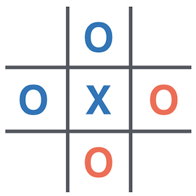
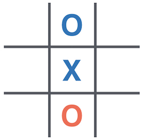

# RL for Wild Tic-Tac-Toe :o::x:

Wild Tic-Tac-Toe is a twist on the classic game of Tic-Tac-Toe.




## Rules of Wild Tic-Tac-Toe :o:

Like normal Tic-Tac-Toe, both players attempt to play 3 of the same counter (`O` or `X`) in a row on a **3 x 3** grid.

**The twist is that both players can choose to play an `O` or a `X`** on any move. The winner is whoever plays the **3rd `X` or `O` in a line** (horizontally, vertically or diagonally) of `X`'s or `O`'s.


In the image above, you can see a win for blue (player 1) resulting from 3 `X`'s, 2 of which were played by blue and 1 by red (player 2). Player 1 goes first, so has placed the winning counter here.



In this image, you can see an ongoing game. You are player 2, playing the red counters. There are `12` possible moves you could make, since you can place an `X` or an `O` on any empty space.

Think about why it may be wise to play an `O` here!

Your task is to build a **Reinforcement Learning agent** that plays **Wild Tic-Tac-Toe**.


# Competition Rules :scroll:
1. You must build a **Reinforcement Learning agent**
    - Rules-based agents aren't allowed!
2. You can only write code in `main.py` and you can only store data in a dictionary (saved in a `.pkl` file by `save_dictionary()`*)
    - In the competition, your agent will call the `choose_move()` function in `main.py` to select a move
    - Any code not in `main.py` **will not be used**.
    - **Check your submission is valid with `check_submission()`**
3. Submission deadline: **5pm GMT, Sunday**.
    - Hit **SUBMIT** in the top right of replit.
    - You can update your code after you submit, but not after the deadline.

  *`save_dictionary()` is a function in `game_mechanics.py`

## Competition Format :crossed_swords:

The competition will consist of your AI playing other teams' AIs 1-v-1 in a knockout tournament fashion.

Since going first gives an advantage, each 1-v-1 matchup consists of a **pair of games**. Each player starts one of the 2 games. In the event of a tie, it will go to a **sudden-death duel** :skull: (tiebreaker games). These 'duels' will be pairs of games with 1 player starting each game.

The competition & discussion will be in [Gather Town](https://app.gather.town/app/nJwquzJjD4TLKcTy/Delta%20Academy) at **5pm GMT on Saturday** (30 mins after submission deadline)!


## Technical Details :hammer:

### The **`choose_move()`** Function

In the competition, the **`choose_move()`** function is called to make your next move. 

**Inputs:**
1. The board - a flat list of strings `""` for empty, `"X"` or `"O"`, where the grid below shows how the list index corresponds to locations on the board. E.g. top left corner is the first element of the list. 

```
0 | 1 | 2
3 | 4 | 5
6 | 7 | 8
```

E.g. `["O", "", "", "O", "", "X", "", "", "X"]` represents:
              
```
O |   |
O |   | X
  |   | X
```


2. The Python Dictionary you have saved as a `.pkl` file

**`choose_move()` outputs a tuple of:**
1. The location to place the counter in as an integer `0 <= location <= 8`
2. The counter to place (either `Cell.X` or `Cell.O` - these are defined in `game_mechanics.py`)

### The **`train()`** Function

Write this function to build the dictionary that your `choose_move` function will use. You just need to return the dictionary to save it and it will automatically be loaded into `choose_move` for you.

**Outputs**:

- Value function dictionary that you've trained (this should then saved by `save_dictionary()` so you can submit a `.pkl` file)Start by discussing the problem with your partner. Write down what the state, the action & the rewards are for this game.

### The **`render()`** Function
Plays a single graphical game against a randomly moving opponent. You play as the blue team.

**Input:**
- choose_move (a function) - your choose_move function which takes just the state as input - 

<details>
<summary><code style="white-space:nowrap;">  WildTictactoeEnv</code> class</summary>
The environment class controls the game and runs the opponent. It should be used for training your agent.
<br />
<br />
See example usage in <code style="white-space:nowrap;">play_wild_ttt_game()</code>.
<br />
<br />
The opponent's <code style="white-space:nowrap;">choose_move</code> function is input at initialisation (when <code style="white-space:nowrap;">WildTictactoeEnv(opponent_choose_move)</code> is called). The first player is chosen at random when <code style="white-space:nowrap;">WildTictactoeEnv.reset()</code> is called. Every time you call <code style="white-space:nowrap;">WildTictactoeEnv.step()</code>, 2 moves are taken: yours and then your opponent's.
    <br />
    <br />
    Both <code style="white-space:nowrap;">  WildTictactoeEnv.step()</code> and <code style="white-space:nowrap;">  WildTictactoeEnv.reset()</code> have <code style="white-space:nowrap;">  verbose</code> arguments which print debugging info to console when set to <code style="white-space:nowrap;">True</code>.
</details>

```
WildTictactoeEnv documentation:

.reset(): starts a new game with a clean board and 
          randomly chosen first player. If your 
          opponent moves first, they take their 1st move. 

.step():  Make a move. This function takes three 
          arguments: position & counter (see 
          choose_move() for more info) and verbose 
          - whether to print the state of the
          board after each move. It returns a 
          tuple of length 4 (see 'Variables' 
          below).

Both reset and step return the same 4 variables:
    observation (List[int]): The state of the board as a 
                             list of ints (see choose_move)
    reward [1, 0, -1]: The reward after the current 
                       move. 1 = win, 0 = draw, -1 = loss.
    done (bool): True if the game is over, False otherwise.
    info (dict): Additional information about the current 
                 state of the game.
                 "winner": game winner, if one exists.
                 "player_move": next player to take a move

```

## Guidance on Building a Winning Agent :trophy: 

1. Start by discussing the problem with your partner. Write down what the **state**, the **action** & the **rewards** are for this game.
    - Ie what should your policy take as input & what should it output?
    - Does that take into account the other team's turn?
2. What should differ between **training** and **playing for real in the competition**? How should this be reflected in your code?
3. What agent do you want to train your agent against? And what do you want to test your agent against?
4. Think about the values of different states. Draw them out.
    - Check the value function of these states in your dictionary
    - Think about how your update rule should work, given you want to look 1 state ahead when acting greedily.
    - :rotating_light: **You and your opponent can play the same moves, so a state you win from is a bad state to move into. You will need to change the update rule to reflect this!!** :rotating_light:
5. Read the docstrings in `game_mechanics.py`, particularly the `WildTictactoeEnv` class
6. **Not working?** Print, debug & test! Particularly with machine learning, it's very difficult to know if your training algorithm & agent does what you think it does.
    - Print out variables to check they are what you think they are, or that they change in the way you expect them to change
    - Write short tests (e.g. check your agent picks a winning move when choosing greedily, or that it doesn't throw away the game when it could)

## Tips on using Replit :technologist:

- Change the `Indent Size` to `4` which changes how many spaces a `TAB` adds in Replit (4 space indentation is standard throughout all Python libraries).
- Change Layout to `side-by-side` (this one is more a personal-preference thing, but I find it much nicer!)
- `Run` (big green button in the top middle) runs the `main.py` file. Even if you have another file selected, it only ever runs `main.py`.

Where to find Replit settings can be seen in the screenshot below.


